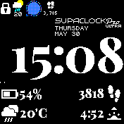

# SUPACLOCK Pro ULTRA

A nice clock, with four ClockInfo areas at the bottom. Tap them and swipe up/down and left/right to toggle between different information.

 - Supports Light and Dark Themes.
 - It has a useless splash-screen for increased ULTRAness
 - Lazy Loading of Clock-Info, shows clock-face faster
 - Uses locale module to display of day and month
 

Based on [LCD Clock Plus](https://banglejs.com/apps/?id=lcdclockplus)

## Screenshots

Light theme

Dark theme

## Credits

Written by devsnd
