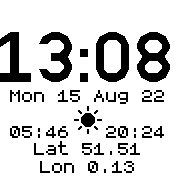
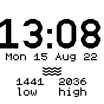

# Seaside utility watch

A watch that does just what I want when I am at the seaside, showing day, date, month, year, sunrise, sunset, location and approximate high and low tide times.

Touch to toggle between sunrise / sunset and tide times.

Very much a work in progress. Sunrise/set requires location to have already been set in mylocation.json using MyLocation app.

DO NOT RELY ON THESE TIDE TIMES! This is in development.

When working, you will set the next tide time (high or low) in application settings, the watch will then calculate approximate next tide time by adding 6 hours and 12 minutes to the tide time and keep doing so until reset.

This may become very unreliable over time and will need periodic realignment.

## Many faults

- [ ] setting a tide time that has passed late in the day works initially but then as it then sets the next tide time to be early the following day, it keeps flipping the times until it reaches a time that has not passed. Eg if the last tide of the day was at 2130, once 2130 is passed it keeps advancing the next tide until 2130 is reached.

## Many of the to-dos

- [ ] handle tide time not being set and remove default time which is just for testing
- [ ] write tide data back to json file when flipped to keep it up to date when app reloaded
- [ ] tidy up code in general
- [ ] no need to check sunrise and sunset times so often
- [ ] consider a web app for setting next tide time or entering real data
