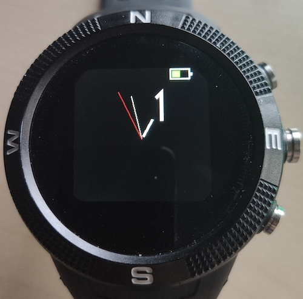
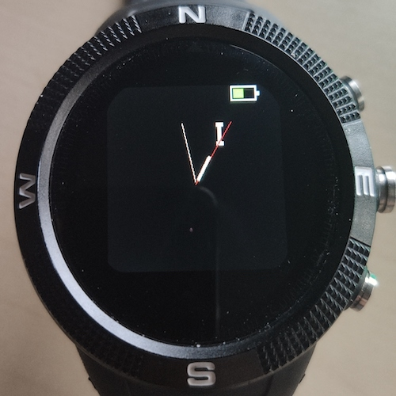
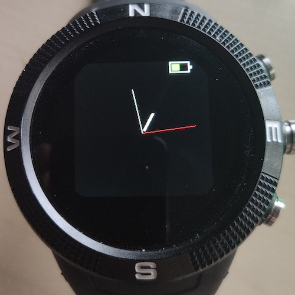
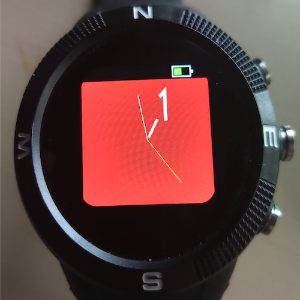
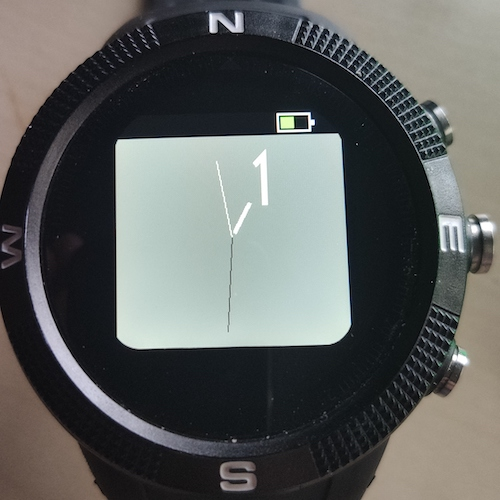
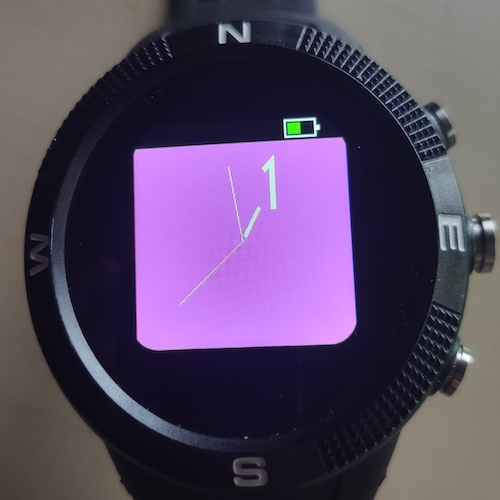
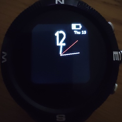
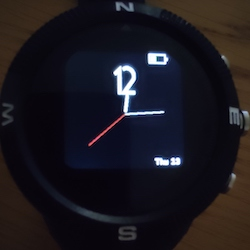
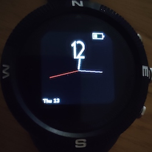
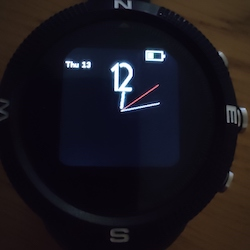

# Sweep Clock

The Sweep Clock provides a clock with a perfectly smooth sweep second hand with a single Numeral Display. 

## Usage

### Button 1

Use Button 1 (the top right button) to change the numeral type 

|   Default clock face   |  Roman Numeral Font    |  No Digits    |
| ---- | ---- | ---- |
|      |      |      |

### Button 3
Button 3 (bottom right button) is used to change the colour

|  Red   |  Grey    |  Purple    |
| ---- | ---- | ---- |
|    |  |     |

### Button 4
Button 4 (bottom left of the screen) is used to change the date position. Note after cycling through the date positions there is the no date option.

|  Top Right   |  Bottom Right    |  Bottom Left    | Top Left |
| ---- | ---- | ---- | ---- |
|    |  |     |    |

## Further Details

For further details of design and working please visit [The Project Page](https://www.notion.so/adrianwkirk/Sweep-hand-clock-6aa5b6b3d1074d4e87fc947975b1e4b7)

## Requests

Please reach out to adrian@adriankirk.com if you have feature requests or notice bugs.

## Creator

Made by [Adrian Kirk](mailto:adrian@adriankirk.com)