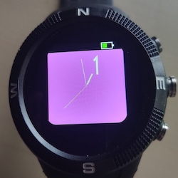

# Sweep Clock

The Sweep Clock provides a clock with a perfectly smooth sweep second hand with a single Numeral Display. 

## Usage

Use Button 1 (the top right button) to change the numeral type 

|   Button 1   |      |      |
| ---- | ---- | ---- |
|      |    |   |

Button 3 (bottom right button) is used to change the colour

|   Button 3   |      |      |
| ---- | ---- | ---- |
|      |    |   |

## Further Details

For further details of design and working please visit [The Project Page](https://www.notion.so/adrianwkirk/Sweep-hand-clock-6aa5b6b3d1074d4e87fc947975b1e4b7)

## Requests

Reach out to adrian@adriankirk.com if you have feature requests or notice bugs.

## Creator

Made by [Adrian Kirk](mailto:adrian@adriankirk.com)
