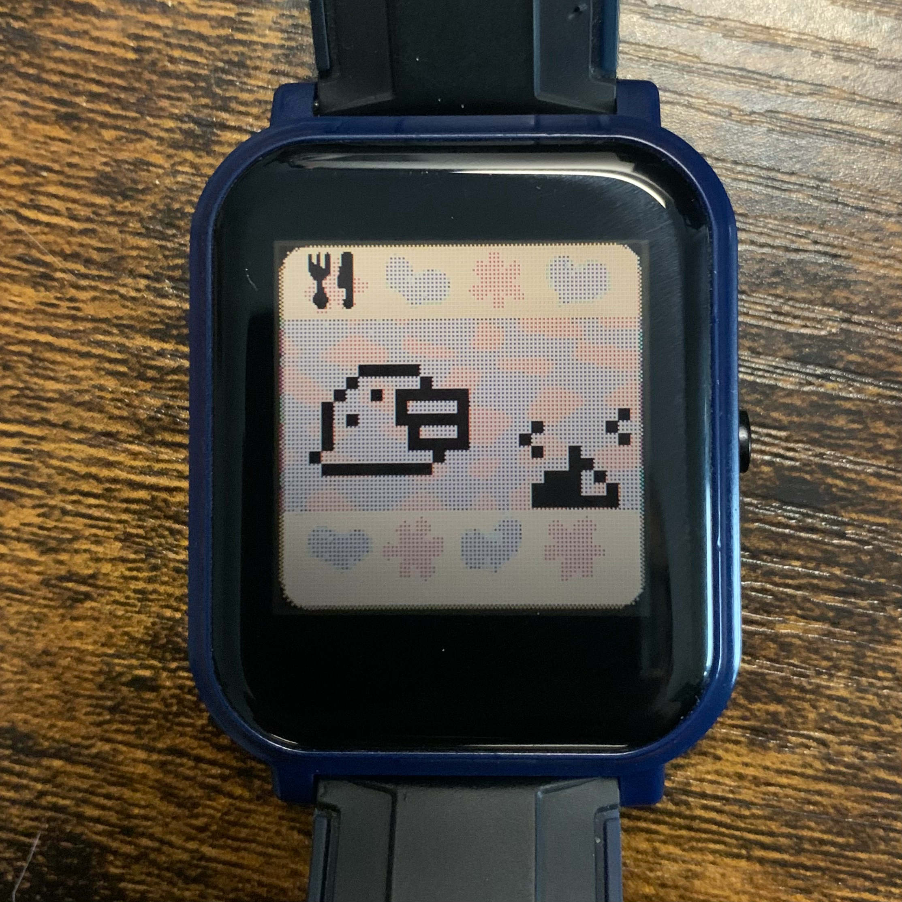

たばんち (tabanchi)
===================

A Tamagotchi clone watch app for the BangleJS2 smartwatch.

Author
------

Written by pancake in 2022, powered by insomnia

Source repository: https://github.com/trufae/tabanchi

Features
--------

* [x] 12/24 clock with HH:mm:ss
* [x] Battery level indicator
* [x] Eating meals and snacks
* [x] Refusing to do things
* [x] Getting sick
* [x] Take a shower
* [x] Switch on/off the light
* [x] Status for happy/hunger/discipline
* [ ] Evolutions
* [ ] Hatching eggs
* [x] Playing a game
* [ ] Education
* [x] Medicine
* [ ] Death

Resources
---------

* Original pixmaps taken from:
  - https://www.spriters-resource.com/resources/sheets/141/144400.png
* Espruino Image converter:
  - https://www.espruino.com/Image+Converter
* Tamagotchi Essentials
  - https://tamagotchi.fandom.com/wiki/Tamagotchi_(1996_Pet)
* Tamagotchi Emulator Source (Java)
  - https://gist.github.com/aerospark/80c60e801398fd961e3f

Screenshots
-----------

