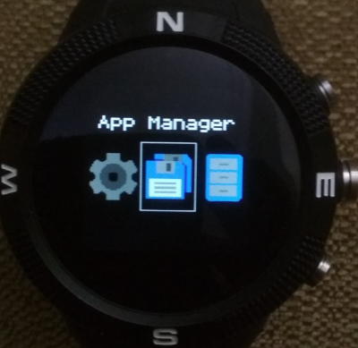

# The Tape App Launcher

Reminiscent of a Telegram or Turing machine tape.

## Controls

**BTN1** - move backward to the previous app icon

**BTN2** - run the selected app

**BTN3** - move forward to the next app icon

**Swipe Left** -  move forward to the next app icon

**Swipe Right** - move backwards (to the left) to the previous app

Written by: [Hugh Barney](https://github.com/hughbarney) For support
and discussion please post in the [Bangle JS
Forum](http://forum.espruino.com/microcosms/1424/)
