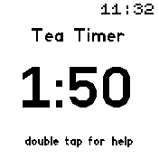
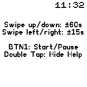
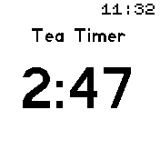
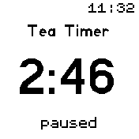

# Tea Timer app

A simple timer. You can easily set up the time. The initial time is 2:30

On the first screen, you can
- double tap to get help
- swipe up/down to change the timer by +/- one minute
- swipe left/right to change the time by +/- 15 seconds
- press Btn1 to start

Press Btn1 again to stop the timer
- when time is up, your Bangle will buzz for 15 seconds
- and it will count up to 60 seconds and stop after that

The time changes can be adjusted in the settings menu.

## Images
_1. Start screen_

Current time is displayed below the Title. Initial time is 2:30.

_2. Help Screen_

_3. Tea Timer running_

Remainig time is shown in big font size.

_4. Pause Timer

While the timer is running, you can pause and unpause it by pressing BTN1.

_5. When time is up_

When time is up, the watch will buzz for 15 seconds. It will count up to 60 seconds.

## Requests

Please mail any issues to thomas.fehling@mailbox.org

## Creator

Thomas Fehling

## Attributions

Icons used in this app are from https://icons8.com
