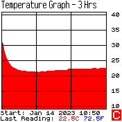
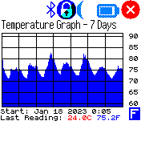
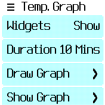

# Temperature Graph

**Temperature Graph** (tempgraph) is a Bangle.js 2 app for recording graphs of the temperature for various time periods from 10 minutes to 7 days long. It samples the watch's temperature sensor 150 times while creating a graph, regardless of the time period selected.

### Menu Options
* **Widgets** Toggles the watch's widgets on and off. With them off gives you a bigger graph when viewing it.

* **Duration** Select the time period for drawing the graph, from 10 minutes to 7 days long.

* **Draw Graph** Draws the graph.
  * Tapping the screen toggles the graph between Celsius (red) and Fahrenheit (blue).
  * Pressing the watch button takes you back to the menu. **Note:** While the graph can still be viewed after returning to the menu, you can't continue recording it if you had returned to the menu before the time period was up. The graph is saved in the watch though so it's still there the next time you start the app.

* **Show Graph** Shows the last drawn graph.
  * Tapping the screen toggles the graph between Celsius (red) and Fahrenheit (blue).
  * Pressing the watch button takes you back to the menu.

* **Save Graph** Sends a screengrab of the graph to the Espruino Web IDE from where you can save it as you would any image on a webpage.

* **Save Data** Sends a CSV file of the graph's temperature data to the Espruino Web IDE where you can save it for further use. I suggest you use the Espruino Web IDE's Terminal Logger (selected in the IDE's Settings/General) to record the data as it's sent. This is the easiest way to save it as a text file.

* **Show Temp** Shows the current temperature.

### Note
Using the watch in a normal fashion can raise the temperature it's sensing to quite a few degrees above the surrounding temperature and it may take half an hour or so to drop to close to the surrounding temperature. After that it seems to give quite accurate readings, assuming the thermometer I've been comparing it to is itself reasonably accurate. So best to load the app then not touch the watch for half an hour before starting a recording. This is assuming you're not wearing the app and are just using it to record the temperature where you've put the watch. You could of course wear it and it'll still draw a graph, which might also be useful.

### Screenshots

### Creator
Carl Read ([mail](mailto:cread98@orcon.net.nz), [github](https://github.com/CarlR9))

#### License
[MIT License](LICENSE)
