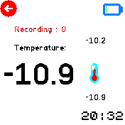
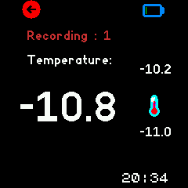

# Temperature Monitor (with logging)
Temperature / Thermometer monitor that not only shows degrees on real time but also allows to store this info in a file for a later process.

Compatible with BangleJS1,BangleJS2,and EMSCRIPTENx emulators

## Pictures:

Bangle JS1

UI for bangleJS1

UI for bangleJS2

Screenshot BJS2

Screenshot BJS1

Screenshot data file content

## Usage

Open and see a temperature in the screen 
Download the CSV file and process in your favourite spreadsheet software
if you have any problem enable the modedebug in code; v_mode_debug=1 or 2

## Features

- Cross compatibility (JS1,JS2) and widgets compatibility 
- BG/FG Colour, Export to file and counter of saved records per session
- File operations: Info, delete (no yet)

## Pending/future Features
- Buttons layout: btn txt(BJS1) , on screen button (BJS2)
- Long press touch to delete file (BJS1,BJS2)
- File operations: Delete 

## Controls/UI
 - Left area: Back/Exit/launcher 
 - BTN3 (long press)(BJS1): default Exit/kill app 

 - BTN1 (BJS2): "Launcher" / open "Messages"
 - BTN2 (BJS1): "Launcher" / open "Messages"
 - BTN1 (BJS1): Change FG Color
 - BTN3 (BJS1): Change BG Color 
 - Right area: Change FG Color 
 - Swipe left: Change BG Color 
 - Swipe right: Increase/Decrease Hour circle/Points 
 
 

## Creator

Daniel Perez
For suggestions or feedback
https://github.com/dapgo/my_espruino_smartwatch_things