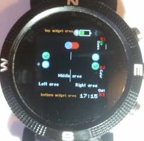
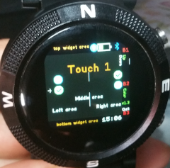

# Test User Input

This basic app, allows to **test the bangle.js input interface** trough every types of finger interaction. 
Interactrion type is displayed in text or a switch on/off image for swipe screen. 

Besides the basics, the UI also includes multiple rows with radio buttons

## Captures

(Following images can be outdated)

Launcher icon

1st screen - Help/Intro

2nd screen - interface and a result

3rd screen - interface and a result

## Usage

Open and see a "help" screen 
Interact with buttons or touch screen to print the event or leave the app

## Features

Colours, font, user input, image, load widgets

## Controls
 - Press left area - Prints Touch1
 - Press righ area - Prints Touch2 
 - Press center area - Prints Touch3
 - Swipe Left - Displays Switch OFF image
 - Swipe Right - Displays Switch ON image
 - BTN1 - Prints Button1, Down (moves selection to next row)
 - BTN2 - Prints Button2
 - BTN3 - Quit to Launcher

## Support

This app is so basic that probably the easiest is to just edit the code 
Otherwise you can contact me [here](https://github.com/dapgo)