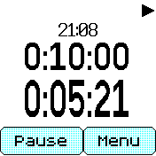

# tev's timer

This Bangle.js 2 app aims to be an ergonomic timer that features:

* Large, easy-to-read fonts
* Multiple simultaneous timer operation
* Interval and repeat timers
* A customizable three-line display

## Basic usage and controls

The main timer screen appears when you start the app. The button on the lower-left of the screen starts or stops the timer. The lower-right button provides a menu for all other functions. If you have created more than one timer, you can swipe left or right above the buttons to quickly switch between them.

## Timer menu

The on-screen menu button displays the following menu items:

* **Reset:** Reset the currently displayed timer back to its starting value.
* **Timers:** Select a different timer to display. The most recently used timer is automatically moved to the top of the list.
* **Edit:** Edit the currently displayed timer
* **Format:** Customize the timer display
* **Add:** Create a new timer with the same parameters as the currently displayed one. The Edit menu will appear allowing you to adjust the newly created timer.
* **Delete:** Delete the currently displayed timer
* **Settings:** Adjust global app settings

## Editing a timer

The following parameters can be adjusted individually for each timer by displaying that timer on the main screen and then selecting **Edit** from the menu:

* **Name:** (available when a keyboard app is installed) Allows you to assign a custom name to the timer to display in menus
* **Start:** Set the starting time of the timer
* **At end:** Allows for creating interval or repeat timers. Selecting “Stop” causes the timer to simply stop when it expires and the resulting alert is dismissed. Selecting a timer here will cause the selected timer to reset and automatically begin counting down once this timer expires. See “Chained timers” below.
* **Vibrate pattern:** Choose the vibration pattern for the alert when the timer expires
* **Buzz count:** Choose the number of times the vibration pattern signals when the timer expires before silencing itself

## Chained timers

When a timer reaches its end, it can be configured to automatically start another timer, forming a chain of timers. For instance, if you create a timer A and a timer B, you can set timer A's **at end** setting to point to timer B. Then when timer A expires, timer B will automatically start. You can then edit timer B's **at end** setting to auto-start yet another timer, and so on. This procedure can be used to create an interval timer. You can also chain a timer to itself to create a repeating timer. If you set timer A's **at end** setting to timer A itself, timer A will repeat indefinitely, sounding an alert each time it expires, until you manually pause the timer. You can furthermore chain a series of timers back to itself to create a repeating set of intervals: timer A to timer B to timer C back to timer A, for instance.

## Display format

Selecting Format from the menu allows you to customize the display. The display has three lines, and each one can be set to one of the following general modes:

* **Current:** Shows the current timer position as it counts down
* **Start:** Shows the starting point of the timer
* **Time:** Shows the current time of day
* **Name:** Shows the name of the timer (if set by a keyboard app; otherwise displays an auto-generated name based on the timer's starting point and current position)

The Current, Start, and Time modes each have three subtypes allowing you to set the precision of the displayed time:

* **HMS:** Hours, minutes, and seconds
* **HM:** Hours and minutes only
* **Auto:** Displays only hours and minutes while the screen is locked; when unlocked, automatically displays the seconds too

The primary benefit to choosing a mode that hides the seconds is to reduce battery consumption when the timer is being displayed for an extended period of time.

## App settings

The Settings option in the menu contains the following options which apply to all timers or to the app as a whole.

### Button, Tap left, and Tap right

Choose a shortcut action to perform when the physical button is pressed (after the screen is unlocked), when the left side of the touch screen (above the buttons when the main time screen is displayed) is tapped, and when the right side of the touch screen is tapped, respectively. By default, pressing the button toggles the timer between running and paused, and tapping either side of the screen brings up the screen for setting the starting time of the timer. These actions can be customized:

* **Start/stop:** Toggle the timer between paused and running
* **Reset:** Reset the timer
* **Timers:** Display the timer selection menu to display a different timer
* **Edit timer:** Display the timer edit menu
* **Edit start:** Display the timer start time edit screen
* **Format:** Display the display format selection screen

### Confirm reset

Normally when you choose to reset a timer, a menu prompts you to confirm the reset if the timer has not expired yet (the Auto option). This helps protect against accidentally resetting the timer. If you prefer to always see this confirmation menu, choose Always; if you would rather reset always happen instantly, choose Never.

### Confirm delete

Likewise, to protect against accidentally deleting a timer a confirmation menu appears when you select Delete from the menu. Setting this option to Never eliminates this extra step.

### On alarm go to

If set to Clock (default), when a timer expires and its alert is displayed, dismissing the alert will return to the default app (normally the preferred clock app). Setting this option to Timer will automatically restart the Tev Timer app instead.

### Auto reset

When a timer expires, it will by default begin counting up a time that represents the amount of time passed before its alarm was acknowledged. If you check this option, the timer will be reset back to its starting point instead, saving you the trouble of doing so manually before using the timer again.

## Timer alerts

When a timer expires, it will display an alert like the ones produced by the standard Scheduler app. For a timer that is not chained, or the last timer in a chain, two buttons “OK” and “Snooze” appear when an alert fires. “OK” completely dismisses the alert, while “Snooze” temporarily dismisses it (it will recur after the snooze interval configured in the Scheduler settings). For chained timers, the options are instead “OK” and “Halt”. “OK” dismisses the individual alert while allowing the next chained timer to continue running in the background, eventually sounding its alert. “Halt” stops the timer and cancels the chaining action, and the display will return to the timer that was running at the point when the “Halt” button was tapped. If you accidentally create a repeating timer that alerts too frequently and makes it impossible to use the Bangle.js watch normally, quickly tap the “Halt” button to stop the chaining action and regain control.
