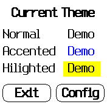
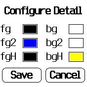
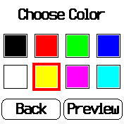
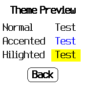

# Theme Setter #

This little tool allows you to configure the global theme of all Bangle.js apps
(provided that they do not override global settings) in a more comfortable way
than through the settings menu.

This app also acts as an example for a non-trivial Bangle.js application
using the "layout" library, custom controls and generic event dispatching.
See [GitHub](https://github.com/rozek/banglejs-2-activities) for details.

## License ##

[MIT License](LICENSE)

## Credits ##

The icon for this app was taken from [icons8.com](https://icons8.com/).