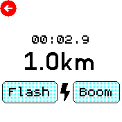

# Come on Thunder

Simple timer to calculate how far away lightning is.

A tribute to [Flash Boom](https://archive.org/details/tucows_33513_Flash_Boom), the greatest app of all time!

## Usage

Use the "Flash" button when you see the flash of lightning, and press the "Boom" button when you hear the rumble of thunder!

## Creator

James Taylor ([jt-nti](https://github.com/jt-nti))

## Icons

- [Cloud Lightning](https://icons8.com/icon/41144/cloud-lightning)
- [Lightning](https://icons8.com/icon/60998/lightning-bolt")
