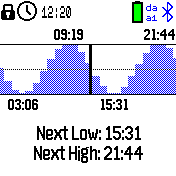
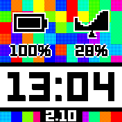
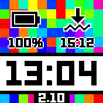

# Tide Times

A simple app to keep track of tide times. Set up the time of the next high/low tide, and this will show you the next high/low tides based on a 6hr 12min interval.

First discussed [on the forum](https://github.com/orgs/espruino/discussions/7854#discussioncomment-14431487)

## Usage

Run the app, and see a tide graph:



Press the button to bring up a menu, where the estimated next low/high tides are.

Choose `Next High/Low` to update the value to what you know is the next high or low tide, tap on the time to confirm. The Tide view will then update.

**Note:** Any time given more than one hour in the past will be considered to be the time of the tide *on the next day*.

## ClockInfo

There is also a Clock Info, so if your clock supports them you show the next high/low tide plus
where you are on the range of the tide. Tapping on the clockinfo takes you to the tides app
for more detailed info.

 

## To Do

* Tapping on the high/low tide clockinfo could toggle between next high/low tide?
* We could get the data from an online source with an `interface.html` that could be run from the app loader. For instance:

```
// high/low
https://api.tidesandcurrents.noaa.gov/api/prod/datagetter?product=predictions&begin_date=20251001&end_date=20251003&datum=MLLW&station=8443970&units=english&time_zone=lst_ldt&interval=hilo&format=json&application=my_tide_app
// actual times per hour
https://api.tidesandcurrents.noaa.gov/api/prod/datagetter?product=predictions&begin_date=20251001&end_date=20251003&datum=MLLW&station=8443970&units=english&time_zone=lst_ldt&interval=h&format=json&application=my_tide_app
// station IDs from:
https://tidesandcurrents.noaa.gov/map/
```

But this is USA-only. Admiralty (UK) and Stormglass (worldwide but rate limited) could also be options

## Creator

Gordon Williams
