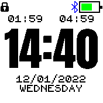
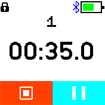
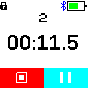
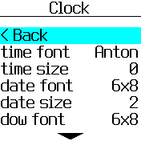
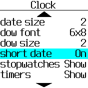
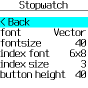

# Timer Clock

A clock based on the Anton Clock with stopwatches, timers and alarms based on the Stopwatch Touch style and an alarm widget based on the one from Default alarm & timer.

## Features

* two slots for stopwatches / timers on the clock screen
* configurable font and size (Anton font has fixed size)
* stopwatch with modifiable start value
* timer that can be paused
* alarms
* multiple stopwatches, timers and alarms
* stopwatches and timers keep running in the background
* optional time of sunrise/sunset using the My Location app - hidden by default

## Images

### Stopwatch

### Settings

## Controls

### Bangle.js 1

#### Clock

* Left: Stopwatch
* Right: Timer
* Button 1 / 2: Alarm

#### Stopwatch / Timer / Alarm

* Button 1: 
  * edit mode: increase
  * control mode: play / pause
* Button 2: switch between edit / control mode
* Button 3:
  * edit mode: decrease
  * control mode: reset / remove
* Left:
  * edit mode: previous index
  * control mode: previous stopwatch / timer / alarm
* Right:
  * edit mode: next index
  * control mode: next stopwatch / timer / alarm

### Bangle.js 2

#### Clock

* Swipe left: Stopwatch
* Swipe right: Timer
* Swipe over date: Alarm

#### Stopwatch / Timer / Alarm

* Swipe left: previous stopwatch / timer / alarm
* Swipe right: next stopwatch / timer / alarm
* Swipe up: increase index swiped over
* Swipe down: decrease index swiped over