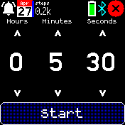
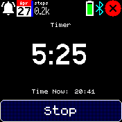

# Simple Timer

Does one thing well. Set a time in hours, minutes and seconds, and alerts you when time is up. Opening the app while the timer is running (or just leaving the app open) shows how much time is left on the timer. This is the part I felt was missing from the Alarms and Timer app.

Drag or tap on the up and down buttons over the hour, minute or second to set the time.

Written by: [Sir Indy](https://github.com/sir-indy) For support and discussion please post in the [Bangle JS Forum](http://forum.espruino.com/microcosms/1424/)