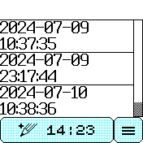

# Timestamp Log

Timestamp Log provides a convenient way to record points in time for later reference. Each time a button is tapped a date/time-stamped marker is logged. By default up to 30 entries can be stored at once; this can be increased up to 100 in the settings menu.

## Usage and controls

When the app starts you will see the log display. Initially the log is empty. The large button on the bottom left displays the current time and will add a date- and time-stamp when tapped. Each tap of the button adds a new entry to the bottom of the log. The small button on the bottom right opens the app settings menu.

If the log contains more entries than can be displayed at once, swiping up and down will move through the entries one screenfull at a time.

To delete an individual entry, display it on the screen and then tap on it. The entry's position in the list will be shown along with a Delete button. Tap this button to remove the entry. The Up and Down arrows on the right side of the screen can be used to move between log entries. Further deletions can be made. Finally, click the Back button in the upper-left to finish and return to the main log screen.

## Settings

The settings menu provides the following settings:

### Log

**Max entries:** Select the maximum number of entries that the log can hold.

**Auto-delete oldest:** If turned on, adding a log entry when the log is full will cause the oldest entry to automatically be deleted to make room. Otherwise, it is not possible to add another log entry until some entries are manually deleted or the “Max entries” setting is increased.

**Clear log:** Remove all log entries, leaving the log empty.

### Appearance

**Log font:** Select the font used to display log entries.

**Log font H size** and **Log font V size**: Select the horizontal and vertical sizes, respectively, of the font. Reasonable values for bitmapped fonts are 1 or 2 for either setting. For Vector, values around 15 to 25 work best. Setting both sizes the same will display the font with normal proportions; varying the values will change the relative height or width of the font.

### Button

You can choose the action that the physical button (Bangle.js v2) performs when the screen is unlocked.

**Log time:** Add a date/time stamp to the log. Same as tapping the large button on the touch screen.

**Open settings:** Open this app settings menu.

**Quit app:** Return to the main clock app.

**Do nothing:** Perform no action.

## Web interface

Currently the web interface displays the list of dates and times, which can be copied and pasted as desired. The log cannot currently be edited with this interface, only displayed.

## Support

Issues and questions may be posted at: https://github.com/espruino/BangleApps/issues

## Creator

Travis Evans
