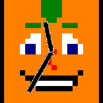
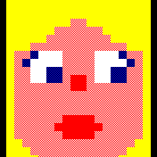
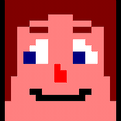
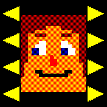

#  Tinyheads

### Which Tinyhead will you create?

Choose from a variety of hairstyles, eyes, noses, and mouths to customize your pixel art style Tinyhead.

## Features

* **Facial Features:**
    * A diverse selection of hairstyles, eyes, noses, and mouths.
    * Choose from 27 different colours.
    * Adjust everything on the Bangle.js itself.
* **Optional Widgets:** Display widgets for added functionality.
* **Clock Options:** Include analog clock hands and a digital clock.
* **Device Status:** Eyes will indicate charging status or Bluetooth connection loss.

## Usage

* Install the Tinyheads Clock via the Bangle.js app loader.
* Configure settings through the Bangle.js configuration menu (Settings app > "Apps" > "Tinyheads clock") or by long-pressing the screen.
* To set as your default watch face, navigate to the Settings app > "System" > "Clock" > select "Tinyheads clock."
* If your Tinyhead appears drowsy, it means the battery is low (<10%).
* While charging, your Tinyhead will "sleep" (eyes will remain closed).

## Configuration

Accesing settings via the standard method (settings app) to go to the main configuration options. Alternatively a long press on the Tinyhead Clock will go directly to the face editing screen. Pressing the button while on this screen will return to the configuration screen, a second press will return to the clock.

### Configuration options

* **Face:** Choose facial features and colours (see below).
* **Analog Clock:** Display analog clock hands. Default: On.
    * Options: On/Off/Unlocked (only visible when screen is unlocked).
* **Analog Colour:** Choose the colour of the analog hands (Black, White, Red, Green, Blue, Yellow, Cyan, Magenta). Default: White.
* **Digital Clock:** Show a digital clock area in 12 or 24-hour format (system setting). Default: Off.
    * Options: On/Off/Unlocked (only visible when screen is unlocked).
* **Digital Position:** Choose the position on the screen (Top/Bottom). Default: Bottom.
* **Show Widgets:** Display the widget area. Default: Off.
    * Options: On/Off/Unlocked (only visible when screen is unlocked).
* **BT Status Eyes:** Eyes indicate Bluetooth connection loss. Default: On.

### Face editing

To edit the face, select "Face" from settings or long-press the Tinyhead.

**Face Features:**
* Hair
* Eyes
* Nose
* Mouth

Use the arrows next to each feature to change them. Tap on a feature to open the color selector. For skin color, long-press anywhere on the face. Tap a color to select it; if you make a mistake, quickly tap the correct color to change it. The selected color will apply after a brief pause.

Use the button to exit the color selector without changes. Pressing the button while on the face editing screen will save your changes and return to the main settings.

Depending on how you accessed settings, pressing the button will take you back to either the Bangle.js settings app or the Tinyheads clock.

## Author

Woogal [github](https://github.com/retcurve)
