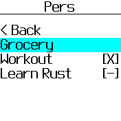
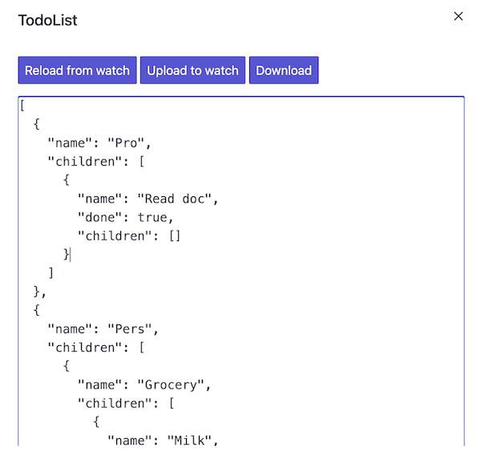

Todo List
========

This is a simple Todo List application.  
The content is loaded from a JSON file.  
A task can be marked as completed or uncompleted.



Once installed, the list can be modified via the `Download data from app` icon in the [Bangle.js App Store](https://banglejs.com/apps/) (TodoList app).




JSON file content example: 
```javascript
[
  {
    "name": "Pro",
    "children": [
      {
        "name": "Read doc",
        "done": true,
        "children": []
      }
    ]
  },
  {
    "name": "Pers",
    "children": [
      {
        "name": "Grocery",
        "children": [
          {
            "name": "Milk",
            "done": false,
            "children": []
          },
          {
            "name": "Eggs",
            "done": false,
            "children": []
          },
          {
            "name": "Cheese",
            "done": false,
            "children": []
          }
        ]
      },
      {
        "name": "Workout",
        "done": false,
        "children": []
      },
      {
        "name": "Learn Rust",
        "done": false,
        "children": []
      }
    ]
  }
]
```