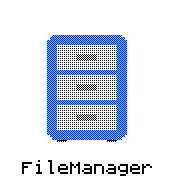

# Toucher - A touch based launcher, swipe left, swipe right, tap to launch

* Designed specifically for Bangle 1 and Bangle 2

## Installation
- Use the App loader to install toucher
- Then delete the existing launcher
- When you restart the new launcher will be loaded
- To return to the default launcher, delete toucher and install the default launcher.

## Bangle 1
In the settings menu 'Low Res' refers to setting the Bangle 1 screen into 80x80 mode.
This significantly improves the animation performance.

## Bangle 2
The Hires/Lowres settings is ignored.
Touch the top third of the screen to launch the selected app.
Press button 1 to launch the selected app.

## Screenshots

