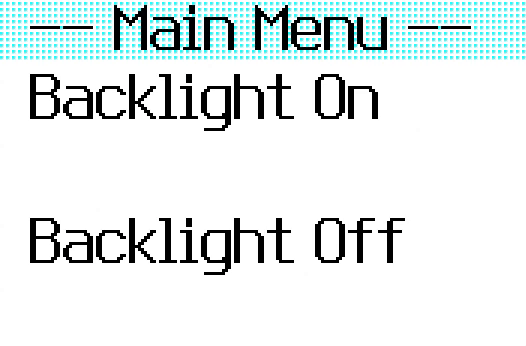

# TouchMenu

A redesign of the built-in `E.showMenu()` to take advantage of the full touch screen on the Bangle.js 2.



## Features

- All of the features of the built-in `E.showMenu()`
- Icon support for menu items:
    ```javascript
    menu.items[0].icon = Graphics.createImage(...);
    ```
- Custom accent colors:
    ```javascript
    E.showMenu({
      "": {
        cAB: g.theme.bg2, // Accent background
        cAF: g.theme.fg2  // Accent foreground
      }
    })
    ```
- Automatic back button detection - name a button `< Back` and it will be given a special position and icon

## Controls

- Scroll through the options
- Tap on an option to select it
- Tap on a button again to use it
- Tap on a selected Boolean to toggle it
- Tap on a selected number to change - tap the right side of the screen to decrease, left side to increase
- If detected, tap on the back button in the upper left to go back

## Requests

Contact information is on my website: [kyleplo](https://kyleplo.com)

## Creator

[kyleplo](https://kyleplo.com)
