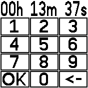
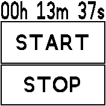
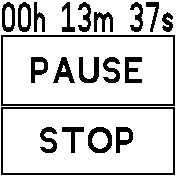
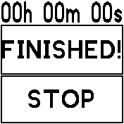
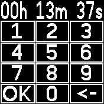
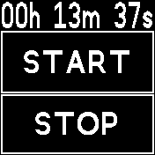
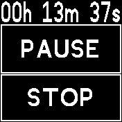
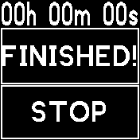

# Touch Timer

Quickly and easily create a timer with touch-only input. The time can be easily set with a number pad.

## How to

- First input the timer time via the input buttons
- If you need to correct the time, press "<-".
- If the timer time is correct, press "OK".
- If you have accidentially pressed "OK", press "STOP" to go cancel.
- Press "START" to start the timer, if the time is correct.
- The timer will run the time until 0. Once it hits zero the watch will buzz for 1 second every 1 seconds for a total of 3 times, or until you press "STOP"
- -> The number of buzzes, the buzz duration, and the pause between buzzes is configurable in the settings app

## Screenshots

### Light Theme

### Dark Theme

