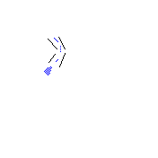

# Trail Rail 

Simple app to follow GPX track

Written by: [Pavel Machek](https://github.com/pavelmachek)

After GPS fix is acquired, it displays familiar arrow with road in
front of you. It never stores whole track in memory, so it should work
with fairly large files.

On startup, you select track you want to work with. After it is
loaded, few screens are available.

1) "Follow" -- displays arrow on the track. Should work well as you
follow the route. If you get lost, press top right corner to "recover".

2) "Map" -- can draw a track around your current position. Press top
right corner to redraw.

3) "Statistics"

Press touchscreen corners to select functions

Zoom    Function
Prev screen Next

## Preparing data

GPX files can be obtained from various services, www.mapy.cz is one of
them (actually uses openstreetmap data for most of the world).

"gpx2egt.sh < file.gpx > t.name.egt" can be used to prepare data, then
upload it to watch. Filename has to be in t.*.egt or r.*.egt format
(suggestion is to use t.* for track "there" and r.* for return track).
