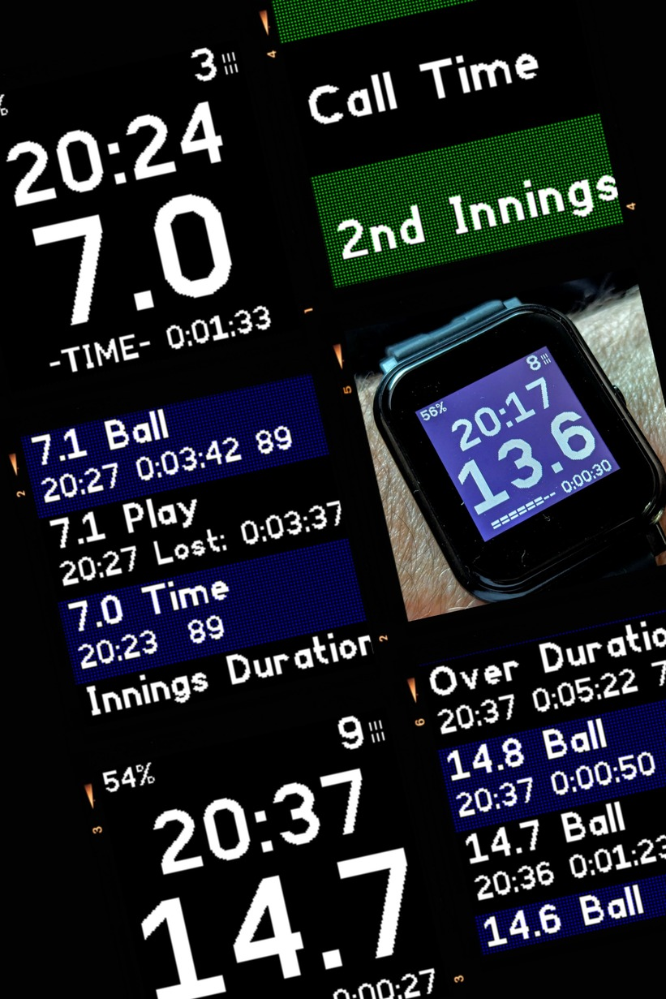

# Umpire Ball Counter
*Cricket umpire ball counter and match event logger for Bangle.js 2 hackable smart watch*

## Background
There are a few ways to keep track of balls when umpiring a cricket match. These vary from the rudimentary - having some stones in your pockets and transferring them from one side to the other - to the "modern" umpire's clicker. The latter allows you to track fairly delivered balls, overs completed and wickets fallen.

In addition, the umpire needs to know the time and to record events like when "Play" was called or when a fielder left the field. These events are written down on paper.

The umpire also needs to assess whether either team is timewasting and whether a new batter has made it out to the crease on time, as required by the Laws.

This app is designed to replace the umpire clicker, and keep track of events for analysis and reporting after each match.

## Objectives ##

The app has three objectives:
1. Count how many balls and wickets have been logged, show the current over number and the time.
2. Log these and other events with a timestamp and a duration since the last event.
3. Allow the data to be viewed on the watch and on a BLE-paired mobile device as structured data.

## Modules ##

The app is split into three screens shown to the umpire:
1. Main Menu
2. In-play Screen
3. Log viewer

There is an additional module to allow settings to be changed via the watch Settings menu; the number of balls in the over and the number of overs in the innings are configurable, so that 15 eight-ball overs, T20, 40-50 overs and The Hundred can all be supported.

A further module of the app is the web page used to view the log file in the app loader. The file can be deleted or a copy downloaded.

## Interaction ##

Bangle.js 2 app interactions are governed by the Bangle and Espruino (E) libraries. This app uses the following patterns:

### Swipe and Button ###

The in-play screen detects swipe and button events using Bangle.setUI.

When in-play, use of the button increments the (fairly delivered) ball count. The app does not suppress the screen lock so by default it requires the umpire to press once to unlock the watch and a second press to log the ball. Bangle.buzz is used to give positive feedback when the app takes action so that the screen does not need to be looked at.

After logging the third-to-last ball in the over, the app buzzes twice. This is typically when the umpire needs to check the balls remaining with the other umpire, in case they have not logged every fair delivery.

After the second-to-last ball the app gives one long buzz to remind the umpire that the next ball will close the over (if fairly delivered).

Logging the final ball triggers the change of over. 

When the last over of the innings is complete the screen shows "END" but allows play to continue to be logged until the new innings is triggered.

Whilst the in-play screen is displayed swiping will cause the following actions to occur:
- **Swipe Up** performs the same action as the Button press, incrementing the ball count.
- **Swipe Down** decrements the ball count and logs the action as a "Correction".
- **Swipe Right** shows the log viewer. 
- **Swipe Left** shows the main menu.

### Confirmation Prompts ###

When choosing "Wicket" or "Recall" from the main menu, E.showPrompt is used to ask for positive confirmation before incrementing or decrementing the wickets, respectively. Those functions also increment or decrement the ball count.

### Scrollers ###

The main menu and log viewer both use E.showScroller to display a scrollable list of tappable items. This is in preference to E.showMenu which has very small touch targets.

Whenever a scroller is shown, the in-play swipe interactions are switched off.

Tapping on the log viewer returns the umpire to the in-play screen.

### Twist to refresh ###

The app uses Bangle.twist to detect the umpire turning their wrist to view the screen and, when the in-play screen is active, will refresh the current time and elapsed time since the last ball.

## Timing ##

The app calculates three durations:
1. **Ball to ball** - When logging a ball the elapsed time since the last logged ball.
2. **Overs** - When logging the last ball of the over, the elapsed time since the last ball of the previous over was logged (or when "Play" was initially called).
3. **Lost Time** - When logging the next ball after a call of "Time" the elapsed time since the call of "Time".

## Other Metadata Logging ##

The app now includes logging of other sensor data from the watch. the following items have been added to the log function:

1. **Steps** - When the app is launched it notes the current step count and then logs the number of steps the umpire has taken on every ball.
2. **Battery Level** - In order to assess whether the heart rate monitor is running the battery down, the battery percentage is logged on every ball.
3. **Heart Rate Monitoring** - The main menu includes an option to "Start HRM" and then the heart rate is logged on every ball.

N.B. The HRM takes about 5 seconds to start measuring the umpire's heart rate. 

Once switched on, the HRM has two additional features:

1. **Battery Saving** - After the Call of Time the HRM is powered down until (Play is called and) the next ball is logged.

2. **Auto-logging** - The app Settings menu has an additional item which is a heartbeat rate over which the app should automatically log an event. Once the umpire's heart rate goes over the limit for 10 consecutive seconds an event will be logged and the in-play screen will show the heart rate on every refresh. Until the heart rate falls below the threshold no further heart events will be logged. A further event will not be triggered until the limit is exceeded again for 20 consecutive seconds. The HRM can be stopped from the main menu during the match.
