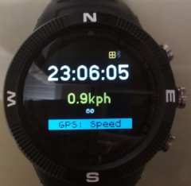
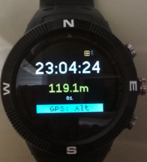

# Walkers Clock

A larg font watch, displays steps, can switch GPS on/off, displays grid reference

The watch works well with GPSsetup, the Activepedom or Widpedom
wdigets.  A tiny GPS power widget is waiting in the wings for when
the v2.09 firware is released.

## Features

- Displays the time in large font
- Uses BTN1 to select modeline display (eg battery status or switch between setting when in a function mode
- Uses BTN3 to select the function mode (eg turn on/off GPS, or change GPS display)
    - two function menus at present
      GPS Power   = On/Off
      GPS Display = Grid | Speed Alt
      when the modeline in CYAN use button BTN1 to switch between options 
- Display the current steps if one of the steps widgets is installed
- Ensures that BTN2 requires a 1.5 second press in order to switch to the launcher
 this is so you dont accidently switch out of the GPS/watch display with you coat sleeve
- Displays the timestamp of the last GPS fix when the GPS is on
- Buzzes when the GPS aquires a positional satellite fix
- Displays the current OS map grid reference in a large font
- Displays the age of the current GPS position fix in seconds
- Works in tandem with the GPS setup app so that you can reduce the power consumption of the GPS

## BTN1 cycles the information line

- By default the modeline is switched off
- Click BTN1 once and display your steps (if one of the step widgets is installed)
- Click BTN1 again and it will show battery % charge
- Click BTN1 again and it will switch the modeline off

## BTN2 Long press to start the launcher

BTN2 is confiured to respond to a 1.5 second press in order to switch
to the launcher App. Simply press and hold until you hear a buzz and
release. This avoids accidently switching out of the watch app when
clothing catches it.

## BTN3 cycles the function mode

- Click BTN3 once and the GPS ON / OFF menu is displayed
- If the GPS is OFF then pressing BTN1 will turn it ON
- If the GPS is ON then Clicking BTN1 will turn it OFF

When the GPS is ON a second function menu can be displayed by
pressing BTN3 again. This will show options to change the GPS display
on the second line of the watch.

- Grid - will display the GPS position converted to an OS Grid Ref
- Speed - will display the GPS speed inforation supplied in the last GPS fix
- Alt - will display the altitude information

## Future Enhancements
* Ability to turn on the heart rate monitor and display the rate on the info line
* Maybe a simple stopwatch capability

Written by: [Hugh Barney](https://github.com/hughbarney) For support
and discussion please post in the [Bangle JS
Forum](http://forum.espruino.com/microcosms/1424/)
