# Waternet
This is the Bangle Js 2 version of my Waternet game which is a multi platform puzzle game initially written for old consoles and handhelds.

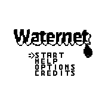 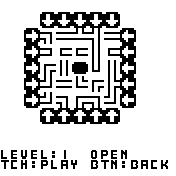 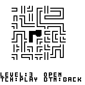

## Game Modes
The aim of the game, in any game mode is always to connect all pipes so that water can flow through them from the water point source. How you can accomplish this depends on the  game mode. The game has a help section in the main menu where you can always check up on the rules of each game mode.

### Rotate Mode
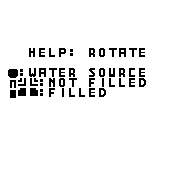 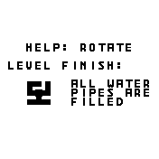 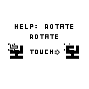 

You need to connect all the pipes so water flows through them, by touching the middle of the screen when the selector is on a pipe, to rotate the single pipe.

### Slide Mode
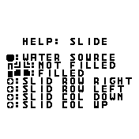 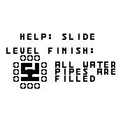 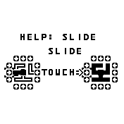

You need to connect all the pipes so water flows through them, by touching the middle of the screen when the selector is on the arrows of a row or column. The row or column will move all pipes in the direction the arrow is pointing at.

### Roslid Mode
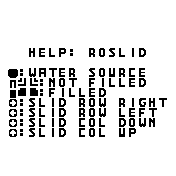 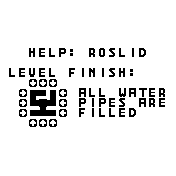 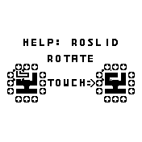 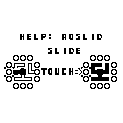

You need to connect all the pipes so water flows through them, by touching the middle of the screen when the selector is on the arrows of a row or column. The row or column will move all pipes in the direction the arrow is pointing at. You can also touch the middle of the screen when the selector is on a pipe, to rotate the single pipe. This is a combination Rotate and Slide mode.

## Features
* 3 game modes (rotate, slide, roslid)
* 5 difficulties per game mode (very easy, easy, normal, hard, very hard)
* 375 levels spread over all difficulties and game modes (25 levels per difficulty and game mode)
* Random mode to generate random levels for each game mode
* Touch controls + option to display up / down / left / right / middle rects of where to touch (to simulate a dpad and button)
* Option to use theming support or not
* Option to Play with or without widgets loaded (full screen)

## Controls
| Button | Action                                                                   |
|--------|--------------------------------------------------------------------------|
| Upper screen Touch | Move up in menus, Move selector up during gameplay |
| Lower screen Touch | Move down in menus, Move selector down during gameplay |
| Left screen Touch | Move selector left during gameplay |
| Right screen Touch | Move selector right during gameplay |
| Middle screen Touch | Confirm in menu and level selector, rotate or slide action while playing |
| Btn or long middle screen touch | Back in menus, level selector and game |

## Requests
You can contact me on my [github](https://github.com/joyrider3774)

## Credits
Waternet game concept is based on the Net and Netslide game from the [Simon Tatham's Portable Puzzle Collection](https://www.chiark.greenend.org.uk/~sgtatham/puzzles/),
it's my own re-implementation of these two game concepts mixed into one game

## Creator
[Willems Davy](https://github.com/joyrider3774)

