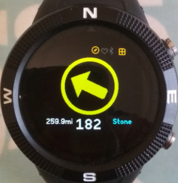
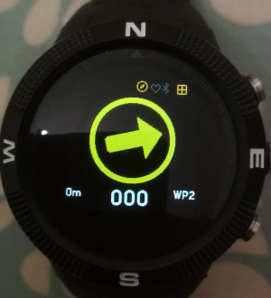
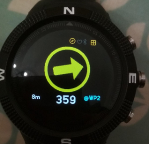

# Waypointer - navigate to waypoints

The app is aimed at navigation whilst walking. Please note that it
would be foolish in the extreme to rely on this as your only
navigation aid!

Please refer to the section on calibration of the compass.  This
should be done each time the app is going to be used.

The main part of the display is a compass arrow that points in the
direction you need to walk in. Once you have selected a waypoint a
bearing from your current position (received from a GPS fix) is
calculated and the compass is set to point in that direction.  If the
arrow is pointing to the left, turning left should straighten the arrow
up so that it is pointing straight ahead.

The large digits are the bearing from the current position. On the
left is the distance to the waypoint in local units. The top of the
display is a circular compass which displays the direction you will
need to travel in to reach the selected waypoint. The blue text is
the name of the current waypoint. NONE means that there is no
waypoint set and so bearing and distance will remain at 0. To select
a waypoint, press BTN2 (middle) and wait for the blue text to turn
white. Then use BTN1 and BTN3 (swipe up/down on Bangle.js 2) to select a waypoint. The waypoint
choice is fixed by pressing BTN2 again. In the screen shot below a
waypoint giving the location of Stone Henge has been selected.

The screenshot above shows that Stone Henge is 259.9 miles from the
current location. To travel towards Stone Henge I need to turn
slightly left until the arrow is pointing straight ahead. As you
continue to walk in the pointed direction you should see the distance
to the waypoint reduce.  The frequency of updates will depend on
which settings you have used in the GPS.

At the top of the screen you can see two widgets.  These are the [GPS
Power
Widget](https://github.com/espruino/BangleApps/tree/master/apps/widgps)
and the [Compass Power Indicator Widget]. These can be installed
seperately and provide you a indication of when the GPS and Compass
are switched on and drawing power.

## Marking Waypoints

The app lets you mark your current location as follows. There are
vacant slots in the waypoint file which can be allocated a
location. In the distributed waypoint file these are labelled WP0 to
WP4. Select one of these - WP2 is shown below.

Bearing and distance are both zero as WP2 has currently no GPS
location associated with it. To mark the location, press BTN2.

The app indicates that WP2 is now marked by adding the prefix @ to
it's name. The distance should be small as shown in the screen shot
as you have just marked your current location.

## Setting Waypoints

Check out the documentation for the `Waypoints` app. This provides
the ability to set waypoints from your browser.

## Calibration of the Compass

The Compass should be calibrated before using the App to navigate to
a waypoint (or a series of waypoints).  To do this use either the
Arrow Compass or the [Navigation
Compass](https://github.com/espruino/BangleApps/tree/master/apps/magnav).
Open the compass app and clicking on BTN3.  The calibration process
takes 30 seconds during which you should move the watch slowly
through figures of 8. It is important that during calibration the
watch is fully rotated around each of it axes. If the app does give
the correct direction heading or is not stable with respect to tilt
and roll - redo the calibration by pressing *BTN3*. Calibration data
is recorded in a storage file named `magnav.json`.

## Advantages and Disadvantages

This approach has some advantages and disadvantages.  First following
the arrow is fairly easy to do and once the bearing has been
established it does not matter if there is not another GPS fix for a
while as the compass will continue to point in the general direction.
Second the GPS will only supply a course to the waypoint (a bearing)
once you are travelling above 8m/s or 28kph.  This is not a practical
walking speed. 5kmph is considered a marching pace.

One disadvantage is that the compass is not very accurate.  I have
observed it being 20-30 degrees off when compared to a hiking
compass.  Sometime its is necessary to walk in the opposite direction
for a bit to establish the correct direction to go in.  The accuracy
of the compass is impacted by the magnetic clamps on the charging
cable, so it is particularly important that you recalibtrate the
compass after the watch has been charged.  That said I have found I
am successfully able to follow a chain of waypoints as a route.

## Possible Future Enhancements

- Buzz when the GPS establishes its first fix.

- Add a small LED to show the status of the GPS during the phase of
  establishing a first fix.

- Add an option to calibrate the Compass without having to use the
  Arrow Compass or the Navigation Compass.

- Investigate the accuracy of the Compass and how it changes
  throughout the day after the watch battery has been fully charged.

- Investigate the possibility of setting the GPS in low speed mode so
  that a current course value can be obtained.

- Buzz when you arrive within 20m of a waypoint to signify arrival

## Acknowledgements

The majority of the code in this application is a merge of
[jeffmer's](https://github.com/jeffmer/JeffsBangleAppsDev) GPS
Navigation and Compass Navigation Applications.

Written by: [Hugh Barney](https://github.com/hughbarney) For support
and discussion please post in the [Bangle JS
Forum](http://forum.espruino.com/microcosms/1424/)
