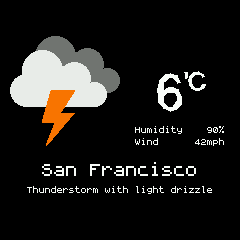

# Weather

This allows your Bangle.js to display weather reports from the Gadgetbridge app on an Android phone.

It adds a widget with a weather pictogram and the temperature.
You can view the full report through the app:

## Setup

1. Install [Gadgetbridge for Android](https://f-droid.org/packages/nodomain.freeyourgadget.gadgetbridge/) on your phone.
2. Set up [Gadgetbridge weather reporting](https://codeberg.org/Freeyourgadget/Gadgetbridge/wiki/Weather).

If using the `Bangle.js Gadgetbridge` app on your phone (as opposed to the standard F-Droid `Gadgetbridge`) you need to set the package name
to `com.espruino.gadgetbridge.banglejs` in the settings of the weather app (`settings -> gadgetbridge support -> package name`).

## Android Weather Apps

There are two weather apps for Android that can connect with Gadgetbridge:

* Tiny Weather Forecast Germany
 * F-Droid - https://f-droid.org/en/packages/de.kaffeemitkoffein.tinyweatherforecastgermany/
 * Source code - https://codeberg.org/Starfish/TinyWeatherForecastGermany
 
* QuickWeather
 * F-Droid - https://f-droid.org/en/packages/com.ominous.quickweather/
 * Google Play - https://play.google.com/store/apps/details?id=com.ominous.quickweather
 * Source code - https://github.com/TylerWilliamson/QuickWeather
 
### Tiny Weather Forecast Germany

Even though Tiny Weather Forecast Germany is made for Germany, it can be used around the world. To do this:
 
1. Tap on the three dots in the top right hand corner and go to settings
2. Go down to Location and tap on the checkbox labeled "Use location services". You may also want to check on the "Check Location checkbox". Alternatively, you may select the "manual" checkbox and choose your location.
3. Scroll down further to the "other" section and tap "Gadgetbridge support". Then tap on "Enable". You may also choose to tap on "Send current time". 
4. If you're using the specific Gadgetbridge for Bangle.JS app, you'll want to tap on "Package name." In the dialog box that appears, you'll want to put in "com.espruino.gadgetbridge.banglejs" without the quotes. If you're using the original Gadgetbridge, leave this as the default.

### QuickWeather

QuickWeather uses Open-Meteo or the OpenWeatherMap API.

If you're using OpenWeatherMap you will need the "One Call By Call" plan, which is free if you're not making too many calls. Sign up or get more information at https://openweathermap.org/api

When you first load QuickWeather, it will take you through the setup process. You will fill out all the required information as well as put your API key in. If you do not have the "One Call By Call", or commonly known as "One Call", API, you will need to sign up for that. QuickWeather will work automatically with both the main version of Gadgetbridge and Gadgetbridge for Bangle.JS.

### Weather Notification

**Note:** at one time, the Weather Notification app also worked with Gadgetbridge. However, many users are reporting it's no longer seeing the OpenWeatherMap API key as valid. The app has not received any updates since August of 2020, and may be unmaintained. 

## Settings

* Expiration timespan can be set after which the local weather data is considered as invalid
* Widget can be hidden
* To change the units for wind speed, you can install the [`Languages` app](https://banglejs.com/apps/?id=locale) which
allows you to choose the units used for speed/distance/temperature and so on.

## Controls

* BTN2: opens the launcher (Bangle.js 1)
* BTN: opens the launcher (Bangle.js 2)
