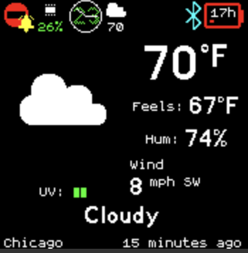

# Weather

This allows your Bangle.js to display weather reports from the Gadgetbridge app for an Android phone, or by using the iOS shortcut below to push weather information.

It adds a widget with a weather pictogram and the temperature.
It also adds a ClockInfo list to Bangle.js.
You can view the full report through the app:



## iOS Setup

Use the iOS shortcut [here](https://www.icloud.com/shortcuts/73be0ce1076446f3bdc45a5707de5c4d). The shortcut uses Apple Weather for weather updates, and sends a notification, which is read by Bangle.js. To push weather every hour, or interval, you will need to create a shortcut automation for every time you want to push the weather.

## Android Setup

1. Install [Gadgetbridge for Android](https://f-droid.org/packages/nodomain.freeyourgadget.gadgetbridge/) on your phone
2. Set up [Gadgetbridge weather reporting](https://gadgetbridge.org/basics/features/weather/)

### Android Weather Apps

There are multiple weather apps for Android that can connect with Gadgetbridge:

* Breezy Weather
  * F-Droid - https://f-droid.org/en/packages/org.breezyweather/
  * Source code - https://github.com/breezy-weather/breezy-weather

* Tiny Weather Forecast Germany
  * F-Droid - https://f-droid.org/en/packages/de.kaffeemitkoffein.tinyweatherforecastgermany/
  * Source code - https://codeberg.org/Starfish/TinyWeatherForecastGermany

* QuickWeather
  * F-Droid - https://f-droid.org/en/packages/com.ominous.quickweather/
  * Google Play - https://play.google.com/store/apps/details?id=com.ominous.quickweather
  * Source code - https://github.com/TylerWilliamson/QuickWeather


### Breezy Weather

Enabling connection to Gadgetbridge:

1. Tap on the three dots in the top right hand corner and go to settings
2. Find "Widgets & Live wallpaper" settings
3. Under "Data sharing" tap on "Send Gadgetbridge data" and enable for Gadgetbridge flavor you are using

### Tiny Weather Forecast Germany

Even though Tiny Weather Forecast Germany is made for Germany, it can be used around the world. To do this:

1. Tap on the three dots in the top right hand corner and go to settings
2. Go down to Location and tap on the checkbox labeled "Use location services". You may also want to check on the "Check Location checkbox". Alternatively, you may select the "manual" checkbox and choose your location.
3. Scroll down further to the "other" section and tap "Gadgetbridge support". Then tap on "Enable". You may also choose to tap on "Send current time".
4. If you're using the specific Gadgetbridge for Bangle.JS app, you'll want to tap on "Package name." In the dialog box that appears, you'll want to put in "com.espruino.gadgetbridge.banglejs" without the quotes. If you're using the original Gadgetbridge, leave this as the default.

### QuickWeather

QuickWeather uses Open-Meteo or the OpenWeatherMap API.

If you're using OpenWeatherMap you will need the "One Call By Call" plan, which is free if you're not making too many calls. Sign up or get more information at https://openweathermap.org/api

When you first load QuickWeather, it will take you through the setup process. You will fill out all the required information as well as put your API key in. If you do not have the "One Call By Call", or commonly known as "One Call", API, you will need to sign up for that. QuickWeather will work automatically with both the main version of Gadgetbridge and Gadgetbridge for Bangle.JS.

### Weather Notification

**Note:** at one time, the Weather Notification app also worked with Gadgetbridge. However, many users are reporting it's no longer seeing the OpenWeatherMap API key as valid. The app has not received any updates since August of 2020, and may be unmaintained.

## Clock Infos

Tap on any clockInfo when focused to directly open the weather app.
Adds:
* Condition ClockInfo with condition icon
* Temperature ClockInfo with condition icon.
* Wind speed ClockInfo.
* Chance of rain ClockInfo.
* Temperature ClockInfo without condition icon.

## Settings

* Expiration time span can be set after which the local weather data is considered as invalid
* Automatic weather data request interval can be set (weather data are pushed to Bangle automatically, but this can help in cases when it fails) (requires Gadgetbridge v0.86+)
* Extended or forecast weather data can be enabled (this requires other App to use this data, Weather App itself doesn't show the forecast data) (requires Gadgetbridge v0.86+)
* Widget can be hidden
* To change the units for wind speed, you can install the [`Languages app`](https://banglejs.com/apps/?id=locale) which
allows you to choose the units used for speed/distance/temperature and so on.

## Controls

* BTN2: opens the launcher (Bangle.js 1)
* BTN: opens the launcher (Bangle.js 2)

## Weather App API

Note: except `getWeather()` and `get()` it is android only for now

Weather App can provide weather and forecast data to other Apps.

* Get weather data without forecast/extended:
  ```javascript
   const weather = require("weather");
   weatherData = weather.getWeather(false);  // or weather.get()
  ```

* Get weather data with forecast/extended (needs forecast/extended enabled in settings):
  ```javascript
   const weather = require("weather");
   weatherData = weather.getWeather(true);
  ```

* Fetch new data from Gadgetbridge:
  ```javascript
   const weather = require("weather");
   weather.updateWeather(false); // Can set to true if we want to ignore debounce
  ```

* React to updated weather data:
  ```javascript
   const weather = require("weather");

   // For weather data without forecast
   weather.on("update", () => {
     currentData = weather.getWeather(false);
     // console.log(currentData);
   }

   // For weather data with forecast
   weather.on("update2", () => {
     currentData = weather.getWeather(true);
     // console.log(currentData);
   }
  ```
