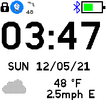

# Weather Clock

A clock which displays the current weather conditions. Time, day of week, date, temperature, wind speed, and an icon indicating the weather condition are displayed.

As of Weather Clock v0.06 the date, day of week, temperature, weather icon and/or wind speed can be hidden in Settings. The icons can be changed to those of the Weather app.

Standard widgets are displayed.

## Requirements

**This clock requires Gadgetbridge and the Weather app in order to get weather data!**

See the [Bangle.js Gadgetbridge documentation](https://www.espruino.com/Gadgetbridge) for instructions on setting up Gadgetbridge and weather.

## Wind speed units

If you want to change the units for wind speed, you can install the [`Languages` app](https://banglejs.com/apps/?id=locale) which
allows you to choose the units used for speed/distance/temperature and so on.

## Creator

James Gough
