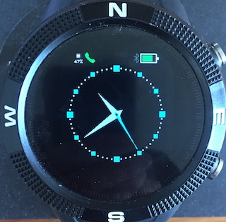

## ANCS - iPhone notifications for Bangle.js

The ANCS widget allows you to answer or cancel iPhone incoming calls and also displays messages and notifications. It connects to the Apple Notification Center Service which is already on all iPhones, so you do not need to install any additional iPhone apps to use this widget.

## Firmware
The widget will run on the standard firmware, however, installation of a slightly modified version - the zip file is available from [this directory](https://github.com/jeffmer/JeffsBangleAppsDev/tree/master/apps/widancs) - will increase the performance of the app by an order of magnitude in terms of the time to connect or reconnect to the iPhone. In addition, the Bangle will stay connected to the iPhone over a greater separation distance than with the standard firmware.




## Installation

After the widget is uploaded to the Bangle, it needs to be enabled in the Bangle Settings app:- `ANCS Widget` will appear in `APP/Widget settings`. There is also a menu in these settings to let you configure the categories of notifications that you want to be displayed. You must disconnect from the App Loader before enabling the widget.

## Compatible Apps

The widget will only run with a compatible app - for the reason for this see Issue 1 below.  The apps that are compatible with the ANCS widget are:- **Multi Clock**, **Navigation Compass** and **GPS Navigation**. When you switch to an app that is not compatible, the ANCS phone icon will not appear. 

## iPhone Pairing
Once enabled, the widget icon should be displayed coloured grey (its green in the photo). Go to the phone's Bluetooth settings menu and your Bangle should appear under Other devices. If this is the first time you have connected with the Bangle from your iPhone, it may be named Accessory. Click on the name and the iPhone should connect and start pairing. The widget icon will turn red and the iPhone will ask you to enter a pairing code - the traditional 123456. You have 10 seconds to enter this after which you will need to start pairing again. After that, the iPhone may also ask to allow the device access to ANCS. Once pairing is complete, the widget icon should go blue and eventually green.  The range of colours is:

* **Grey** - not connected - advertising
* **Red** - connected - not paired.
* **Blue** - paired and connected - getting services
* **Yellow** - got Services.
* **Green** - waiting for new notifications.

After pairing the first time, the Bangle should connect automatically when the widget is running. Sometimes you may need you to click on the Bangle name in `Settings:Bluetooth:My devices` on the iPhone or disable and then enable Bluetooth to start connection. If you need to load other apps from the iPhone, it will be necessary to ask the iPhone to forget the pairing and you will also need to disable the widget in Settings and restart the Bangle by turning it off in Settings and then pressing BTN1 to restart. If you are loading apps from a different device, you simply need to turn off the iPhone bluetooth which will retain the pairing. You still need to disable the widget and restart the Bangle.


## Messages & Calls
Messages are displayed as shown above until BTN2 is pressed to dismiss it. I strongly advise disabling the BTN2 LCD wake function in the Settings App as otherwise when the screen times out and you press BTN2 to wake the LCD, the screen will turn on and the Message Alert will be dismissed!. Calls can be answered or dropped.

   


## Issues
1. With GadgetBridge, the Android phone has a Central-Client role with the Bangle as Peripheral-Server. With the ANCS widget there is the fairly unusual situation in which the Bangle is Peripheral-Client to the iPhone's Central-Server role. Since Espruino does not deal explicitly with Bangle as Peripheral-Client an additional function has been added in the modified firmware: `var gatt = NRF.getGattforCentralServer(addr);`. This returns a bluetooth remote GATT server given the address of the iPhone which has just connected to the Bangle. With the standard firmware, the widget reconnects to the iPhone as a Client - however this has greatly degraded performance.  See  [Issue 1800.](https://github.com/espruino/Espruino/issues/1800) for more details. 

2. When the Bangle switches apps, all state - including widget state - is lost unless explicitly stored. The consequence of this is that when the Bangle switches apps, the connection to iPhone has to be re-established to restore the remote GATT server and characteristics state. This is quite slow. To minimise reconnection, the widget needs to grab the screen from the running app to signal messages and calls. To allow this to work, the app needs to implement the `SCREENACCESS` interface. In essence, the widget only connects when running with compatible apps that implement this interface. An example implementation is:

```
var SCREENACCESS = {
      withApp:true,
      request:function(){
        this.withApp=false;
        stopdraw(); //clears redraw timers etc
        clearWatch(); //clears button handlers
      },
      release:function(){
        this.withApp=true;
        startdraw(); //redraw app screen, restart timers etc
        setButtons(); //install button event handlers
      }
}

Bangle.on('lcdPower',function(on) {
  if (!SCREENACCESS.withApp) return;
  if (on) {
    startdraw();
  } else {
    stopdraw();
  }
});
```
 
## Support

Please report bugs etc. by raising an issue [here](https://github.com/jeffmer/JeffsBangleAppsDev).