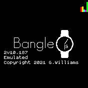

# Bars Widget

A simple widget that display several measurements as vertical bars.

## Measurements from left to right:
<!-- HRM and Temperature are commented out (they didn't seem very useful)
- Current heart rate, on a scale from 0-200 bpm (*red*) 
  Only if available: this widget does not turn on HRM monitoring by itself.
- Device temperature, on a scale from 0-50 °C (*yellow*)  
-->
- Flash storage space used (*blue/cyan*)    
- Memory usage (*magenta*) 
- Battery charge (*green*)