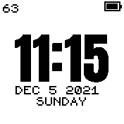
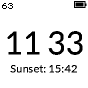

# Battery Level Widget (Themed)

Shows the current battery level status in the top right using the clocks colour theme

* Works with Bangle 2
* Simple design, no settings
* 27 pixels wide
* Uses current colour theme to match clock

Written by: [Hugh Barney](https://github.com/hughbarney)  For support and discussion please post in the [Bangle JS Forum](http://forum.espruino.com/microcosms/1424/)
