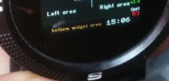

# Digital clock widget (bottom widget area)
This very basic widget clock shows time inside apps that respect the bottom widget area, also allows to test this unfrequently used area.

Note that it will not be displayed when a clock app is been shown

Compatible with BangleJS1,BangleJS2,and EMSCRIPTENx emulators

forked from
https://github.com/espruino/BangleApps/tree/master/apps/widclk

## Photo  

Example of usage

Screenshot emulator bangle.js2

## Usage

Upload the widget file
Open an app (not a clock/watchface) that supports displaying widgets (included the bottom one)

## Support

This app is so basic that probably the easiest is to just edit the code ;)

Otherwise you can contact me [here](https://github.com/dapgo/my_espruino_smartwatch_things)