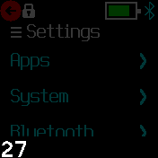

# Day Widget

Just shows the day of the current date, to save space in the widget area. The month and year should be known because they don't change that often. Just the number in maximum size for readability.

## Creator
[@pidajo](https://github.com/pidajo)

