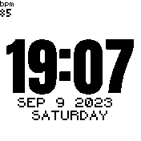

# Last announced heartrate BPM Widget

* Displays the last announced bpm measurement from Bangle.on('HRM', ...);
* it does not enable the heartrate sensor to do measurements it waits on such annoucement. I use it to view the last read value when letting the system take a reading every 10 minutes.
* saves last read value to a file so it can display that last value between app starts / reboots

Code based on Lato Pedometer Written by: [Hugh Barney](https://github.com/hughbarney)
Code Modified by: [Willems Davy](https://github.com/joyrider3774)
