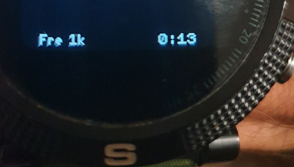

# hw stats bttom widget (bottom widget area)
A basic HW/performance monitor widget that shows on real time some technical info, such as free mem, free storage, trash mem, files, FW version. Also allows to test the unfrequently used widget bottom area.

Compatible with BangleJS1,BangleJS2,and EMSCRIPTENx emulators
Dynamic Color dependant on Theme color bg

forked from my widclkbttm (Digital clock bttom widget)

## Photo  

Example of usage

Screenshot emulator

## Usage

Upload the widget file
Open an app (not a clock/watchface) that supports displaying widgets (included the bottom one)
Different info is refreshed following a predefined frequency and sequence.

## Support

This app is so basic that probably the easiest is to just edit the code ;)

Otherwise you can contact me [here](https://github.com/dapgo/my_espruino_smartwatch_things)