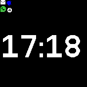

# Messages Grid Widget

Widget that displays multiple notification icons in a grid.
The widget has a fixed size: if there are multiple notifications it uses smaller
icons.
It shows a single icon per application, so if you have two SMS messages, the
grid only has one SMS icon.
If there are multiple messages waiting, the total number is shown in the 
bottom-right corner.

Example: one SMS, one Signal, and two WhatsApp messages:

## Installation
There can only be one messages widget, so you should uninstall the default "Message Widget".

## Settings
You can change settings by going to the global `Settings` app, then `App Settings`
and `Messages`:

* `Flash icon` Toggle flashing of the widget icons.
<!-- * `Show read` - Also show the widget when there are only old messages. -->
* `Widget messages` Not used by this widget.