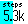
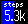

# Step counter widget
This is my step counter. There are many like it, but this one is mine.

A pedometer widget designed to be as narrow as possible, but still easy to read, by sacrificing accuracy and only showing to the nearest 100 steps (0.1k).
Shows a subtle fill colour in the background for progress to the goal. The goal is picked up from the health tracker settings.

