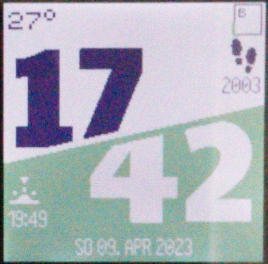

# Temperature widget
A simple temperature widget, showing the current microcontroller's internal temperature (E.getTemperature()).

It updates every minute. If the current temperature is above the last 10 minutes average, the text is shown in red. If below, the text is shown in blue and black otherwise.

