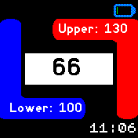

# Summary
Workout heart rate monitor that buzzes when your heart rate hits the limits.

This app is for the [Bangle.js watch](https://banglejs.com/). While active it monitors your heart rate
and will notify you with a buzz whenever your heart rate falls below or jumps above the set limits.

# How it works
[Try it out](https://www.espruino.com/ide/emulator.html?codeurl=https://raw.githubusercontent.com/msdeibel/BangleApps/master/apps/wohrm/app.js&upload) using the [online Espruino emulator](https://www.espruino.com/ide/emulator.html).

## Setting the limits

Use the settings menu to set the limits. On the Bangle.js1 these can in addition be set with the buttons:

For setting the lower limit press button 4 (left part of the watch's touch screen).
Then adjust the value with the buttons 1 (top) and 3 (bottom) of the watch.

For setting the upper limit act accordingly after pressing button 5 (the right part of the watch's screen).

## Reading Reliability
As per the specs of the watch the HR monitor is not 100% reliable all the time.
That's why the WOHRM displays a confidence value for each reading of the current heart rate.

To the left and right of the "Current" value two colored bars indicate the confidence in 
the received value: For 85% and above the bars are green, between 84% and 50% the bars are yellow
and below 50% they turn red.

## Closing the app
Pressing middle button will switch off the HRM of the watch and return you to the launcher.

# HRM usage
The HRM is switched on when the app is started. It stays switch on while the app is running, even
when the watch screen goes to stand-by.

Screenshot BJS2 emul

