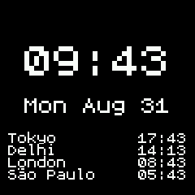

# World Clock - See the time in five locations

In addition to the main clock and date in your current location, you can add up to four other locations. Great for travel or remote working.

## Usage

Provide names and the UTC offsets for up to four other timezones in the app store. These are stored in a json file on your watch. UTC offsets can be decimal (e.g., 5.5 for India). 

The clock does not handle summer time / daylight saving time changes automatically. If one of your four locations changes its UTC offset, you can simply change the setting in the app store and update. Currently the clock only supports 24 hour time format.

## Requests

[Reach out to Scott](https://www.github.com/computermacgyver) if you have feature requests or notice bugs.

## Creator

Made by [Scott Hale](https://www.github.com/computermacgyver), based upon the [Simple Clock](https://github.com/espruino/BangleApps/tree/master/apps/sclock).
