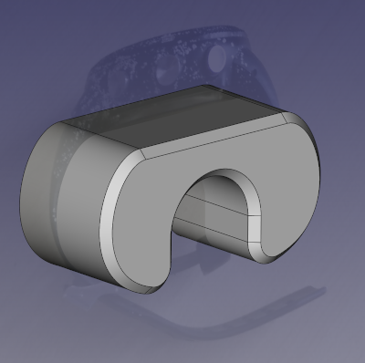

# Waypointer Moto

Waypointer Moto is a GPS navigation aid intended to be attached to
the handlebars of a motorcycle.
It uses the GPS to find out which direction it's
travelling and shows the direction and distance to the destination
"as the crow flies". It gives you an indication of where to go,
but exploring and navigating the environment is left up to the user.

(Please note that it would be foolish in the extreme to rely on this
as your only navigation aid! Make sure you read this entire document
before using the app for navigation so that you know the drawbacks
and shortcomings.)

## App usage

### Main screen

The main screen shows the direction arrow, the distance to the waypoint,
and the name of the selected waypoint.

It also shows the status of the GPS fix in the colour of the arrow:

 * Red: no GPS fix at all
 * Yellow: GPS location, but no GPS course (probably you're moving too slowly);
   in this case the direction of travel comes from the compass bearing instead
   of the GPS course, but note that the compass is unreliable
 * White: GPS fix includes both location and course, and the GPS course is used
   to determine the direction of travel

### Select a waypoint

Press the middle button (`BTN2`) to enter the menu, choose a waypoint using
the up/down arrows, and use the middle button again to select a waypoint and
return to the main screen.

### Add a waypoint

Press the middle button (`BTN2`) to enter the menu, and select the "+ Here"
option. This will add a waypoint named "WP*n*" marking your current location,
where "*n*" is the next unused number.

### Delete a waypoint

Select a waypoint using the menu. Once the waypoint is selected and you're
back on the main screen, press either the top or bottom button (`BTN1` or
`BTN3`), or, on Bangle.js 2, scroll the screen up or down.
Confirm that you want to delete the waypoint with the middle
button (`BTN2`).

## Waypoint editor

With the Bangle.js app loader connected to the watch, find the
Waypointer Moto app and click on the floppy disk icon:

This will load up the waypoint editor:

### Add a waypoint

Click on the map to add a waypoint. You'll be prompted to give it
a name.

### Edit a waypoint

Click on the map marker of the waypoint you wish to edit. You
can then click on the blue pencil icon to edit the name of the
waypoint. If you want to move the waypoint to a new location then
you need to delete it and re-add it.

### Delete a waypoint

Click on the map marker of the waypoint you wish to delete. You
can then click on the red bin icon to delete the waypoint.

### Add a route

Click on the map to place the first waypoint. The name of the first
waypoint will become the name of the route.

Click on the map marker for the new waypoint and click "Make route".
Now every time you click on the map it will add another point
on this route. When you're done either right click or click the
"Close route" button above the map.

Points along the route don't have names by default, but if you wish
to add one you can click on the waypoint and use the blue pencil icon
to give it a name.

### Delete a route

Click on the map marker for any point on the route, and select
"Delete entire route".

## Mounting the watch on the bike

There is a 3d-printable "artificial wrist" which will fit over a 7/8"
handlebar and allow the watch strap to tighten up.
Alternatively, in a pinch you can strap the watch around a glove or a sponge
or anything else that will pad out the space so that the watch is a tight
fit.

The 3d-printed part should be a snug fit on the handlebar so that it does
not flop around. If it is too loose, line it with a layer or 2 of tape.

[Download the handlebar mount STL &raquo;](handlebar-mount.stl)

[Download the handlebar mount FreeCAD source &raquo;](handlebar-mount.FCStd)

## Comparison to Way Pointer

Compared to the original Way Pointer app, Waypointer Moto:

 * removes the numerical display of compass bearing
 * makes the distance text bigger
 * uses a higher-resolution arrow icon
 * has a visual indication of the GPS status (the arrow colour)
 * uses GPS course instead of compass bearing
 * has OpenStreetMap integration in the waypoint editor
 * uses Bangle.js menus to select waypoints instead of custom UI
 * can add new waypoints from inside the app without requiring a blank slot
 * can delete waypoints from inside the app without needing the PC
 * still uses the same `waypoints.json` file
 * supports "routes" which automatically step from one waypoint to the next

## Gotchas

Waypointer Moto derives your current heading from the GPS course
rather than the compass, whenever GPS course is available.
The compass bearing is based on the angle the watch is held, but
the GPS course is based on the direction it's *travelling*. If the
watch is not aligned with the direction of travel of the vehicle
then the arrow will not point in the correct direction.

When travelling too slowly, there is no GPS course information, so the
app reverts to using the compass (and draws it in yellow), but
the compass is not very reliable, and I
have especially found it not to be reliable when placed on a motorcyle,
maybe because of all the metal in the immediate vicinity. So if
the arrow is not drawn in white, then you should probably not trust
it. If you're not sure, just ride in a straight line until the arrow
turns white again.

## Possible Future Enhancements

 - some way to manually input coordinates directly on the watch
 - make the text & arrow more legible in direct sunlight
 - integrate a charging connector into the handlebar mount
 - upstream the map integration to the other waypoint apps

## Acknowledgements

Waypointer Moto is a project by [James Stanley](https://incoherency.co.uk/). It is a derivative of [Adam Schmalhofer's](https://github.com/adamschmalhofer) Way Pointer app, which is in turn a derivative of
[jeffmer's](https://github.com/jeffmer/JeffsBangleAppsDev) GPS
Navigation and Compass Navigation apps.
