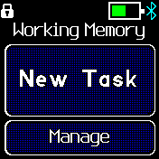
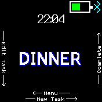
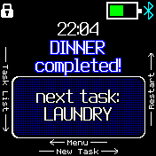
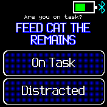
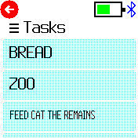
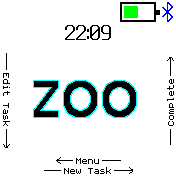

# Working Memory Helper
Human brains keep track of what they are doing in a conceptual space known as "working memory". Older adults and people
of all ages with ADHD often struggle to maintain information in their working memories, causing them to forget what
they were doing only moments after deciding to do it. One excellent way to combat this symptom is to externalize your
working memory.

This app doesn't completely externalize and replace working memory, but it does act as a prosthesis for the task
management aspect of working memory. The workflow looks something like this:

1. Decide to do something. (If you can't get this far on your own, this app is not gonna help.)
2. Immediately enter a brief prompt in the app as a "task". For example, if you were going to take out the trash, 
you might write "Trash". If you were going to take your car to the mechanic, you might write "car", or "mechanic". It 
doesn't have to remind you what you were doing a week from now, only a minute or so, so it can be very simple / brief.
3. Thirty seconds after you enter the task into the app, your device will vibrate and ask you if you are on task, or if 
you got distracted.
   1. If you are on task, hit "On task" and the app will wait a little longer before reminding you again.
   2. If you got distracted, hit "distracted" and the app will remind you a little sooner next time.
4. Continue getting reminders from your watch at various intervals until you complete the task, then tell the app the 
task is complete. Repeat this process for every single thing you do until you die, basically.

   
  

## Requirements
You must have some kind of keyboard library available in order to enter task descriptions on your device. This app is 
only supported on BangleJS2

## Styling
This app attempts to match whatever theme your Bangle watch is using. You can also modify whether individual
words are wrapped and whether outlines are drawn on text.

## Task settings
You can edit the settings of any individual task. You can rename the task, restart (un-complete) the task, or change
some of the reminder cadence settings. As far as cadence, there are a couple that warrant explanation:

### Interval
This is the base reminder interval for your task. If it is 30, your first reminder will be after 30 seconds.

### Incremental Backoff
Incremental backoff is a strategy for timing the reminder notifications you get based on how well you stay on task.
Each time you affirm that you are "on task", incremental backoff means it will wait longer before reminding you again.
Similarly each time you affirm that you are "distracted" the incremental backoff will wait less time before reminding 
you again. The exact intervals are multiples of the base interval. For a task with a base interval of 30 seconds, the 
second reminder would be after 60 seconds. The third after 120 seconds, etc.  Then if you got distracted it would go
back to 60, then 30, then 15. Typically the interval will never go below 1/2 of your base interval.

If you disable Incremental Backoff, you will be reminded once every base interval no matter what you do. This can be
handy if you are having trouble staying on task when the intervals get too long with incremental backoff.

## Controls
A large focus of this app was making clear affordances for the user interface. Anything that can be pressed should look
like a button, however you may notice some small arrows and text on the sides / top / bottom of the screen  in some
cases. These hints are there to tell you that you can swipe across the screen to perform additional actions.
Swipe your finger anywhere on the screen in the direction the arrow is pointing to use the listed function.

## Known issues
The clock is not super-duper accurate because it only updates when the screen refreshes (which can be 30 seconds or 5 
minutes apart). I put it on there, though, because it is more useful to be there and lagging by 30+ seconds than to be 
not there at all. I plan to fix this problem eventually but it's secondary to the main functions of the app at the 
moment.