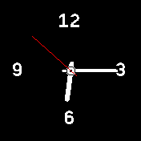
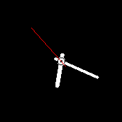
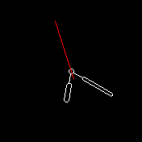
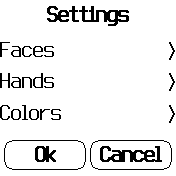
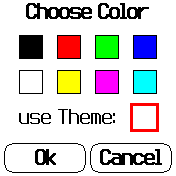

# Configurable Analog Clock #

This app implements an analog clock with various faces, hands and colors to
choose from.

You have the choice between:

* 4 different clock faces  &nbsp;  &nbsp;  &nbsp;  and
* 3 different clock hands (optionally with or without second hands)  &nbsp;  &nbsp; 

Additionally, you may use the currently configured global theme or configure
your own colors for clock fore- and background and second hands.

Just swipe up or down to switch from clock display to the first configuration
screen and continue from there

 &nbsp;  &nbsp;
 &nbsp;  &nbsp;

Chosen settings will be written to the Bangle.js's flash memory and restored
whenever the clock is started again.

This clock also acts as an example for the building blocks found in the author's
[GitHub repository](https://github.com/rozek/banglejs-2-activities)

## License ##

[MIT License](LICENSE)
